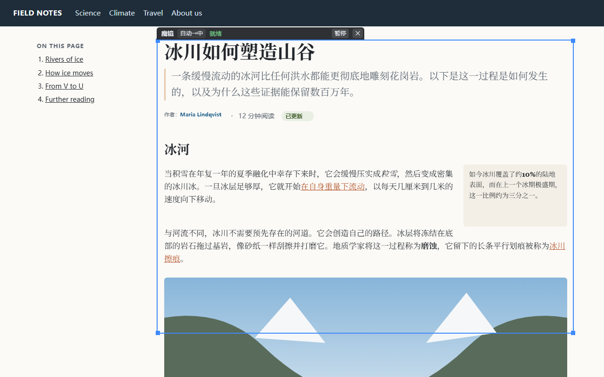
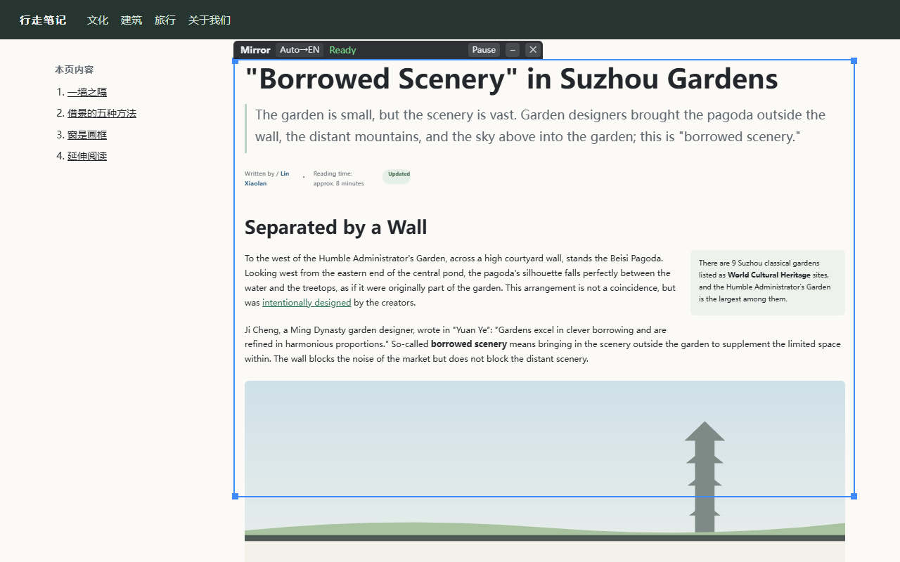

English | [简体中文](README.zh-CN.md)

# DeskMirror for browsers

Translate web pages in place. A "mirror" frame sits on the page, and you can drag it and resize it. Inside the frame, the same spot of the page appears translated, keeping the page's own layout, fonts, colors, images and links. Outside the frame, the page stays as it is, so you can always tell which sentence is which.

This is the browser companion of [DeskMirror](https://github.com/Yudreamsky/deskmirror), the Windows app that translates anything on your screen (apps, games, video subtitles).

| English page → Chinese | Chinese page → English |
|---|---|
|  |  |

## Install

- **Chrome Web Store**: under review.
- **From source**: download this repository, open `chrome://extensions`, turn on *Developer mode*, click *Load unpacked* and choose the `extension` folder. Settings opens after installation.

## Use

- Click the toolbar icon or press `Alt+Shift+M` to open the mirror on the current page; press it again to close it.
- Drag the dark tab to move the mirror; drag the blue border to resize it.
- Links, buttons and input boxes inside the mirror still work: clicks go to the real page underneath.
- Hold `Ctrl+Alt+O` to peek at the original; the language button on the tab switches the translation direction.
- The tab shows the tokens sent (↑) and received (↓) since the mirror opened; hover over it to see exact numbers.
- Click `–` on the tab to collapse the mirror into a bubble. Drag the bubble to either side and it snaps to the edge; click it to bring the mirror back where it was.
- Two skins under *Appearance* in Settings: Classic, or Liquid Glass (frosted and rounded, follows the system light or dark mode).

## Translation services

- **On your own computer**: Ollama or LM Studio. Free, and the text never leaves your PC.
- **Cloud**: many providers are built into Settings (OpenAI, Gemini, Claude, DeepSeek, Qwen, GLM, Kimi, OpenRouter and more), plus any OpenAI-compatible API. Enter your own API key, then *Get models* lists the models you can use.
- **Backup services**: line up several. When one runs out of credit, has a wrong key, retires a model, can't be reached or is too slow, the next takes over without redoing finished text, and the tab shows which backup is in use.

## Privacy

There is no account, no developer server and no analytics. Page text is sent only to the translation service you choose, and API keys stay in this browser on your computer. Full policy: [store/privacy-policy.md](store/privacy-policy.md).

## How it works

The extension keeps a live copy of the page in a sandboxed, same-origin iframe stacked exactly over the real page, like two sheets of paper. Text blocks in the copy are replaced by their translations, and each block's size is locked to the original, so the two sheets stay aligned. Only the frame's area of the copy is visible. Clicks go through to the real page. Scrolling is synchronized on the compositor with scroll-driven animations, so the copy doesn't lag behind while scrolling. Canvases, videos, iframes and input boxes show the real page through holes. Translated text that sits on top of a canvas is shown again over the hole, so node-based apps like Comfy Cloud work.

## Development

There is no build step and no npm dependency; the tests need Node 22+ and Chrome.

```bat
node --test tests\unit\*.test.mjs
node tests\run.mjs identity article.html
node tests\chain.mjs
node tests\canvas.mjs
node tests\usage.mjs
node tests\bubble.mjs
node tools\pack.mjs
```

`tools\pack.mjs` builds the store zip in `dist\`. See [README.zh-CN.md](README.zh-CN.md) for every test and the measurements.

## Support

DeskMirror is free and open source. If it helps you, you can [buy me a coffee on Ko-fi](https://ko-fi.com/dreamskyu). The *Support the author* section at the bottom of Settings also has a WeChat code. Feedback: a885187@gmail.com or GitHub issues.

## License

[GPL-3.0](LICENSE)
